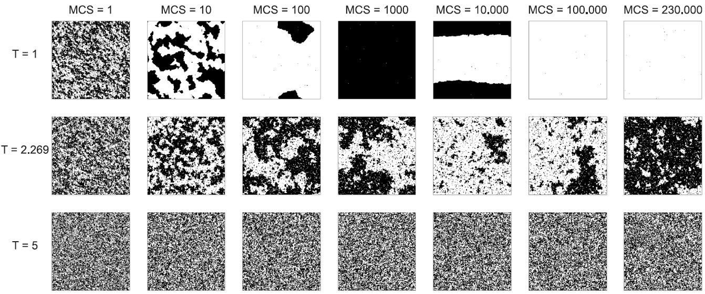

# The role of dimensionality reduction in Neural Network based identification of phase transitions
The repository contains programs and models for investigation of estimating phase-transitions in 2D Ising model using Deep Neural Networks and comparison of the results with data compressed by PCA algorithm. The results are part of Master Thesis written on Big Data Analytics at Wrocław University of Science and Technology (WUST)
In short:
 - Ising model and Monte-Carlo simulations are written in `C++ 20`. We used `pcg` random number generator.  
 - Data being collected are spin configurations (binary matrices) for different matrix size. 
 - For every dataset, a Deep Neural Network model there was created, separately trained and analyzed. ML Models are written in `Python 3.8` with help of `Tensorflow` and `Keras`. 
 - Predictions were repeated on data transformed by dimensionality reduction technique - PCA (from `scikit-learn`) and compared with result on original data.
 - The main goal was to estimate the critical temperature - indicating phase transition in Ising model using Neural Networks and check the impact of dimensionality reduction on estimations.
____
## Phase transitions & Ising Model
Statistical mechanics explains macroscopic behaviour of complex systems from the behaviour of large assemblies of microscopic entities. One of the main topics in this area is the research on `phase transitions`, i.e., the abrupt changes of the system (typically behaved dramatically), due to the change of a macroscopic variable.

The **Ising (or Lenz-Ising) model** is the most popular and most unversal model of analyzing phase transitions. We consider 2-dimensional model, since in 1D there is no phase transitions to observe. In the Ising model we consider L x L lattice (or graph in general) of spins (or atoms/agents etc). By analogy to magnetic moments, every spin can take one of the two possible values: "up" / "down" (e.g. 1 or -1). The lattice with spins set in such a way is called `spin configuration`.

Basically, we observe the change of the order parameter, which in this case is called magnetization, i.e., average spin in single configuration:

The order parameter is different than zero in low temperatures, that is below the critical point (Curie Temperature) -- which indicates ordered, ferromagnetic phase. If we cross the critical point, i.e., the temperature of the system will be sufficiently high, the order parameter is approximately zero and the system is in paramagnetic (disordered) phase. For Ising model, we assume the critical temperature near T ~ 2.269.
___
## Monte Carlo simulations of the Ising Model

Data to train and test machine learning model consists of the spin configurations of size: L = 10, 20, 30, 40, 50, 60 sampled by monte carlo steps (MCS). The method used to update configuration is called **Metropolis-Hastings Algorithm**. For every configuration size, we perform simulation for 30 000 MCS as thermalization time and collect data for 200 000 MCS. Temperature range, for which simulation was ran, includes 176 different values from: `linspace(0.5, 4.0, 0.02)`. In summary, dataset for *single configuration size* consists of 2000 samples per temperature, 352176 in total. 
Here you can see the change of the system during the simulation time for three different temperatures: above critical temperature (Tc), approximately in Tc and below critical value:

We can see that above critical temperature, the system is in high fluctuations that do not disappear with time. In other hand, below Tc the system ends up in established state -- approximately all spins take the same sign (are in the same direction). 
___
## Deep Neural Networks in identification of phase transition
For collected datasets, modeling and training of neural networks was perfomed in separate notebooks, but in similar way. Since every L x L configuration is basically binary matrix, there is no need to normalize data, but small preprocessing including change of numerical type and creating array of labels [0 - for T<2.26, 1 - otherwise]  and converting it to categorical format was applied. Networks are built using Keras Functional API. We have 2 Dense layers, every layer has 100 neurons in case of smaller configuration size (<30) and 200 for higher dimensional data. The output layer consists of 2 neurons for **two classes**: *low-temperatures* and *high-temperatures*. Other parameters:
1. `Activation functions`: ReLU for hidden layers, softmax for output layer.
2. `Loss`: Categorical Cross Entropy
3. `Optimizer`: Adam
4. `Regularization method`: L_2 norm + early stopping in callbacks.

The obtained accuracy of training on the test set is around 99% in general. 

Results of predictions are output probabilities, averaged over 1000 samples. The trajectories are presented below (red color for high-temperatue class).

Here is the estimation of the critical point based on the predictions. We use finite size scaling to stack all crossing points from the plot above and fit the linear regression and read the intercept value. In the diagram below, the green line indicates range of standard error of intercept.

Estimated value of the critical temperature: 
`T ~= 2.2695 +/- 0.0026`

Now, if we are sure, that our system predicts phase of the system based on binary matrix, we can apply dimensionality reduction on original data and repeat training and predictions of models described above. Basically, the PCA method was applied for 75% of retained explained variance, 50% and below 35% of variance. The most reduced case is for keeping 2 principal components. In general, the result of dimensionality reduction is possible without significant loss of training accuracy (about 0.5-1% in comparison to training on original data), which is caused by sparsity of data -- a flagship case of **curse of dimensionality**. 

**Projections of 1000 samples on first two principal components**

**Output layer averaged over validation set after PCA and 2 components as function of temperature**

**Finite size scaling on crossing temperatures for data reduced by PCA to 2 components**

Estimated value of the critical temperature based on low-dimensional data: 
`T ~= 2.2685 +/- 0.0019`

Notice that all estimated critical points are within the error range of theoretical value.
